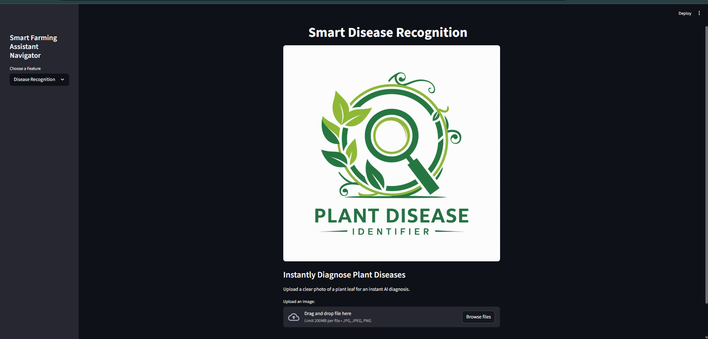

# Smart Farming Assistant: An AI-Powered Agricultural Toolkit 🌱

[](https://www.python.org/)
[](https://streamlit.io/)
[](https://www.tensorflow.org/)
[](https://scikit-learn.org/)

An intelligent, multi-feature web application built with Streamlit, designed to empower farmers with data-driven insights for sustainable and profitable agriculture.

---
### 🚀 Live Demo

You can access the live, deployed application here:

[](https://smart-farming-assistant.streamlit.app/)

---

---

## 📌 Project Overview

This project was developed as part of the **Green AI Skills Internship**, powered by the **Edunet Foundation**, **AICTE**, and **Shell**. The primary goal was to analyze an existing open-source AI application, understand its complex architecture, and enhance it into a unified, user-friendly, and practical tool for farmers.

The result is a one-stop solution that provides farmers with AI-powered insights for Crop selection, Disease Prediction, Fertilizer recommendation and Weather planning, helping to improve yield and promote sustainability.

---
---

### 📸 Application Screenshots

Here's a gallery of the main features of the Smart Farming Assistant.
| HOME PAGE |
| :---: |
|   |

| Crop Recommendation | Disease Recognition |
| :---: | :---: |
|  |  |

| Fertilizer Recommendation | Weather Forecast |
| :---: | :---: |
|  |  |


---

## ✨ Key Features

* **🌿 Smart Crop Recommendation:** Utilizes a Random Forest model to recommend the most suitable crop based on soil and climate data.
* **🔬 Instant Disease Recognition:** Employs a Convolutional Neural Network (CNN) to instantly diagnose 38 different types of plant diseases from a leaf image.
* **💊 Actionable Remedies:** Provides practical, easy-to-understand remedies for any detected disease.
* **🧪 Fertilizer Recommendation:** Uses a Random Forest model to suggest the optimal fertilizer based on soil conditions and crop type.
* **☀️ Real-Time Weather Forecast:** Integrates a live weather forecast feature using the OpenWeatherMap API.
* **📚 Beginner-Friendly Guides:** Includes in-app guides explaining how to measure parameters, making the tool accessible to all users.

---

## 🎯 Project Features & Results

### 🌿 1. Smart Crop Recommendation

**Explanation:** This feature functions as an intelligent advisor for farmers. By providing 7 key environmental and soil parameters (Nitrogen, Phosphorus, Potassium, Temperature, Humidity, pH, and Rainfall), the system uses a machine learning model to predict the most suitable crop.

**Dataset Used:** The model was trained on the **Crop Recommendation dataset**, containing 2200 rows of data for 22 different crops. The dataset is available in the `datasets` folder (`Crop_recommendation.csv`).

**Model Training:** The complete model selection and training process can be reviewed in the Jupyter Notebook/VS Code : `training_files/Crop_Recommendation.ipynb`.
 
**Model Selection and Evaluation:** To ensure the highest accuracy, seven different machine learning algorithms were evaluated.

| Model Algorithm | Accuracy on Test Set (%) |
| :--- | :---: |
| **Random Forest** | **99.55%** |
| XGBoost | 99.09% |
| Gaussian Naive Bayes | 99.09% |
| K-Nearest Neighbors | 97.5% |
| Logistic Regression | 95.23% |
| Decision Tree | 90% |
| Support Vector Machine (SVC)| 10.68% |


#### **Conclusion**

Based on the comparative analysis, the **Random Forest Classifier was selected** for the final application. It demonstrated superior performance by achieving the **highest accuracy of 99.55%**, proving its robustness and capability in handling the intricate patterns within the agricultural data to provide highly reliable crop recommendations.

---


### 🔬 2. Smart Disease Recognition

**Explanation:** This module acts as a digital plant pathologist. Farmers can upload an image of a plant leaf, and a deep learning model analyzes it to identify one of 38 possible diseases. The system also provides an actionable remedy for the detected disease.

**Dataset Used:** The CNN was trained on the [**New Plant Diseases Dataset (Augmented)**](https://www.kaggle.com/datasets/vipoooool/new-plant-diseases-dataset) from Kaggle, which contains over 87,000 images (70,295 for training and 17,572 for validation) across 38 classes.
The dataset is available in the training_files folder (Crop_recommendation.csv).

**Model Used:** Convolutional Neural Network (CNN) built with TensorFlow and Keras.

**Results:** The CNN was trained for 10 epochs and demonstrated excellent learning capabilities.


* **Final Training Accuracy:** **98.12%**.
* **Final Validation Accuracy:** **96.52%**.

---

### 🧪 3. Smart Fertilizer Recommendation

**Explanation:** To ensure optimal plant nutrition, this feature recommends the best type of fertilizer. It uses a machine learning model that takes into account soil nutrient levels, climate conditions, and the specific crop being grown.

**Dataset Used:** The model was trained on the **Fertilizer Recommendation dataset**, which contains data for 7 different fertilizers based on soil and crop types. The dataset is available in the `training_files` folder (`Fertilizer_recommendation.csv`).

**Model Used:** `RandomForestClassifier` from Scikit-learn.

**Results:** The model was trained and evaluated, learning the complex relationships between the input parameters and the appropriate fertilizer type with a high degree of predictive accuracy.


* **Model Accuracy on the test set: 
:** **95.00%**.

---

### ☀️ 4. Real-Time Weather Forecast

**Explanation:** This utility feature provides farmers with immediate access to real-time weather conditions for any location. This is crucial for planning activities like irrigation, fertilization, and pesticide application.

**Technology Used:** Live data is fetched using the **OpenWeatherMap API** and the `requests` library in Python.

**Results:** The feature successfully connects to the API and returns the current weather data for the user-specified city.
* **Displayed Data:** Temperature (°C), Humidity (%), Wind Speed (m/s), and a general description of the weather conditions.


---

## 🛠️ Technology Stack

| Technology      | Purpose                               |
| --------------- | ------------------------------------- |
| **Python** | Core programming language             |
| **Streamlit** | Building the interactive web interface|
| **TensorFlow** | For the CNN-based disease detection   |
| **Scikit-learn**| For the Random Forest recommendation models|
| **Pandas** | Data manipulation and analysis        |
| **NumPy** | Numerical computations                |
| **Pillow** | Image processing                      |
| **Requests** | Making API calls for weather data     |

---

## 🚀 Setup and Installation

Follow these steps to run the application locally:

**1. Clone the repository:**
```bash
git clone https://github.com/Rudrateja123/Smart-Farming-Assistant.git
cd Smart-Farming-Assistant
````

**2. Create a virtual environment (recommended):**

```bash
python -m venv venv
venv\Scripts\activate  # On Windows
# source venv/bin/activate  # On macOS/Linux
```

**3. Install the required libraries:**

```bash
pip install -r requirements.txt
```

**4. Add your API Key:**

  - In the project folder, create a new folder named `.streamlit`.
  - Inside `.streamlit`, create a new file named `secrets.toml`.
  - Open `secrets.toml` and add your key: `OPENWEATHERMAP_API_KEY = "PASTE_YOUR_NEW_API_KEY_HERE"`

**5. Run the application:**

```bash
streamlit run app.py
```

The application will open in your default web browser.

-----


## 🙏 Acknowledgements

This project is an enhanced and unified implementation based on the original **AgriSens** project by **[ravikant-diwakar](https://github.com/ravikant-diwakar)**. My work involved analyzing the initial complex structure, debugging the individual modules, training a new fertilizer recommendation model, integrating all components into a single functional Streamlit application, and significantly improving the user interface and overall usability.

-----


## 📄 License

This project is licensed under the MIT License.
